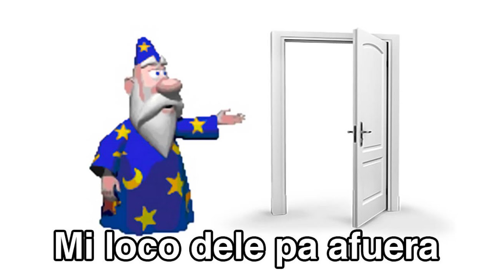

# comandos recurrentes

| zip  | `zip -r jdorado.zip .` | comprime el directorio actual |
| :--- | :--------------------- | :---------------------------- |
| ts   | `npx tsc`              | copila el proyecto TS         |

##  ](img/lambda-min.png) Lambda  

**comando master:** `aws lambda`

| Func       | comandos               |
| :--------- | :--------------------- |
| crear      | `create-function`      |
| actualziar | `update-function-code` |

| banderas          | descripcion                        |
| :---------------- | :--------------------------------- |
| `--function-name` | nombre de la funcion en el Aws     |
| `--runtime`       | entorno de ejecucion               |
| `--handler`       | el punto de entrada de la función  |
| `--role`          | aqui va el arn de un rol existente |
| `--zip-file`      | la ubiacion de tu archivo zip      |

### Ejemplo para crear una lambda

se debe remplazar los [ ]

    aws lambda create-function --function-name [jdorado-lambda] --runtime [nodejs20.x]  --role [arn:aws:iam::637423527733:role/lambda-basic] --handler [index.handler] --zip-file [fileb://jdorado.zip]

### Ejemplo para actualziar una lambda

se debe remplazar los [ ]

    aws lambda update-function-code --function-name [nombre-funcion] --zip-file [fileb://jdorado.zip]

>*NOTA : antes de crear o acutalizar la lambda debe compilar y comprimir primero.*

---

##  IAM: rol y politica

**comando master:** `aws iam`

| Func  | comandos          |
| :---- | :---------------- |
| crear | `create-role`     |
| crear | `put-role-policy` |

| banderas                        | descripcion                                 |
| :------------------------------ | :------------------------------------------ |
| `--role-name`                   | nombre del rol a crear o existente          |
| `--assume-role-policy-document` | ruta del archivo trust-policy [crear]       |
| `--policy-name`                 | nombre de la politica                       |
| `--policy-document`             | ruta del archivo de la politica configurada |

### Ejemplo para crear un rol y asignarle politica

se debe remplazar los [ ]

    Se crear el rol 
    aws iam create-role --role-name [lambda-basic] --assume-role-policy-document [file://iam/trust-policy.json] 

    Se crea la politica
    aws iam put-role-policy --role-name [lambda-basic] --policy-name [lambda-policy] --policy-document [file://iam/lambda-policy.json]

>*NOTA : antes de crear el rol y la politica se debe crear esos dos archivos.*

---

##  ApiGateWay

**comando master:** `aws apigateway`

| Func              | comandos          |
| :---------------- | :---------------- |
| crear api         | `create-rest-api` |
| crear sub recurso | `create-resource` |
| insertar metodo   | `put-method`      |
| integrar recurso  | `put-integration` |

| banderas               | descripcion                         |
| :--------------------- | :---------------------------------- |
| api                    | -----                               |
| `--name`               | nombre de la apigateway             |
| recurso                | -----                               |
| `--rest-api-id`        | id de la api creada                 |
| `--parent-id`          | id del recurso root de la api       |
| `--path-part`          | path o el nombre del recurso        |
| metodo                 | -----                               |
| `--rest-api-id`        | id de la api creada                 |
| `--resource-id`        | id del recurso recien creado        |
| `--request-parameters` | parametros de header                |
| `--http-method`        | motodos http [ post, get, delete..] |
| `--authorization-type` | el tipo de autorizacion             |
| integracion            | -----                               |
| `--nn`                 | nn                                  |

### Ejemplo para crear un apiwateway

se debe remplazar los [ ]

>*para este ejemplo se tiene que estar altanto del output al ejecutar los comando.*  
>*se debe seguir paso a paso en orden.*  
>*se debe tener una lambda creada.*

    Creacion de la api

    aws apigateway create-rest-api --name [apiFakeTest]

    output:
    {
        "id": "j90ssydnr6", <--- id del api = rest-api-id
        "name": "apiFakeTest",
        "createdDate": "2024-04-13T20:59:58-05:00",
        "apiKeySource": "HEADER",
        "endpointConfiguration": {
            "types": [
                "EDGE"
            ]
        },
        "disableExecuteApiEndpoint": false,
        "rootResourceId": "asd4511" <--- id recurso root = parent-id
    }
---
    Creacion de un sub recurso

    aws apigateway create-resource --rest-api-id [j90ssydnr6] --parent-id [asd4511] --path-part [test]
    
    output: 
    {
        "id": "j90ssydnr6", <--- id del subRecurso recien creado
        "parentId": "asd4511", <--- id del recurso root
        "pathPart": "test",
        "path": "/test"
    }
---
    Se le asigna un metodo a ese subRecurso recien creado

    aws apigateway put-method --rest-api-id j90ssydnr6 --resource-id yme94g --http-method GET --authorization-type "NONE" --no-api-key-required --request-parameters "method.request.header.custom-header=false"
    
    output: no se hace nada
    {
        "httpMethod": "GET",
        "authorizationType": "NONE",
        "apiKeyRequired": false
    }
---
      Se le asigna metodos de respuesta y repuesta de integracion

      aws apigateway put-method-response --rest-api-id j90ssydnr6 --resource-id yme94g  --http-method GET --status-code 200 --request-parameters "method.request.header.custom-header=false"

      output: no se hace nada
        {
            "statusCode": "200",
            "responseParameters": {
                "method.response.header.content-Type": true}
        }

---
    Se integrar el subrecurso creado con una lambda

    aws apigateway put-integration --rest-api-id j90ssydnr6 --resource-id yme94g --http-method GET --type AWS --integration-http-method GET --uri arn:aws:apigateway:us-east-1:lambda:path/2015-03-31/functions/arn:aws:lambda:us-east-1:637423527733:function:jdorado-lambda/invocations  

    output: no se hace nada
    {
        "type": "AWS",
        "httpMethod": "GET",
        "uri": "arn:aws:apigateway:us-east-1:lambda:path/2015-03-31/functions/arn:aws:lambda:us-east-1:637423527733:function:jdorado-lambda/invocations",
        "passthroughBehavior": "WHEN_NO_MATCH",
        "timeoutInMillis": 29000,
        "cacheNamespace": "yme94g",
        "cacheKeyParameters": []
    }
---

 y se supone que deberia funcionar porque todo se lo asigna en el comando integration, pero no sé porque falla
parace que falta colocar algo mas en el put-method-response

##  S3

**comando master:** `aws s3`

| Func         | comandos |
| :----------- | :------- |
| crear bucket | mb       |

| banderas | descripcion          |
| :------- | :------------------- |
| --region | region donde se crea |

### Ejemplo para crear un s3  

se debe remplazar los [ ]

    aws s3 mb [s3://test-jdorado] --region [us-east-1]

---

> # Listar recursos varios 

    aws lambda list-functions --query 'Functions[*].[FunctionName,Runtime,Handler]' --output table`

    aws s3 ls

    aws apigateway get-rest-apis
---

## documentacion oficial del Real AWS

[ Guia de todos los comandos y esenarios posibles](https://docs.aws.amazon.com/cli/latest/userguide/cli_code_examples_categorized.html)

[ Guia para el response](https://docs.aws.amazon.com/apigateway/latest/developerguide/api-gateway-method-settings-method-response.html)

# Ahora si

