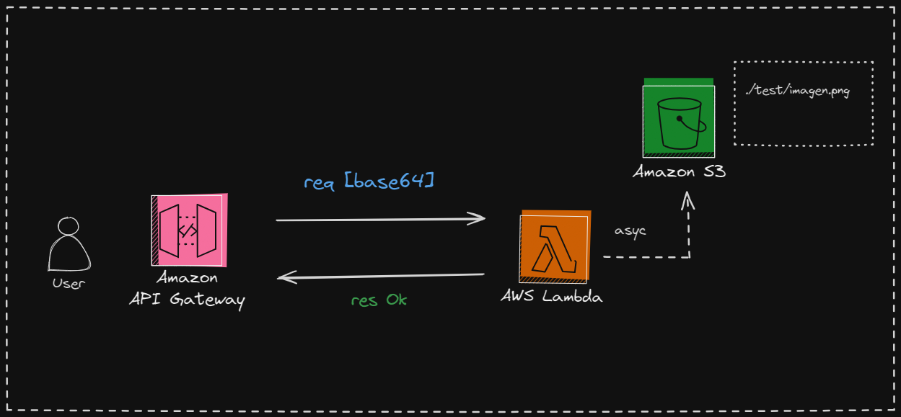

# Practica de Lambda S3 y Apigateway

MediSe tiene que crear una lambda que guarde en un s3 en una carpeta especifica.

- Crera bucket con CLI
- Crear role con póliticas necesarias para la lambda
- Crear lambda con CLI
- Crear ApigateWay en consola

---

## Pasos para la practica

1. Crear el s3 con el CLI

         aws s3 mb s3://test-QX --region us-east-1

2. Crear Rol y Politicas
   - Se crear el rol (tomar archivo trust-policy.json de iam)

            aws iam create-role --role-name lambda-basic --assume-role-policy-document file://iam/trust-policy.json

    - Se le asigan politicas necesarias (tomar archivo lambda-policy.json de iam)

            aws iam put-role-policy --role-name lambda-basic --policy-name lambda-policy --policy-document file://iam/lambda-policy.json

3. Crear lambda Basica con el CLI

        aws lambda create-function 
        --function-name test-lambda-QX
        --runtime nodejs20.x  
        --role arn:aws:iam::1379452633:role/lambda-basic 
        --handler lambda/index.handler --zip-file fileb://test-lambda-QX.zip

4. Se crea ApigateWay en la consola de AWS y se integra con la lambda
[falta capt]

